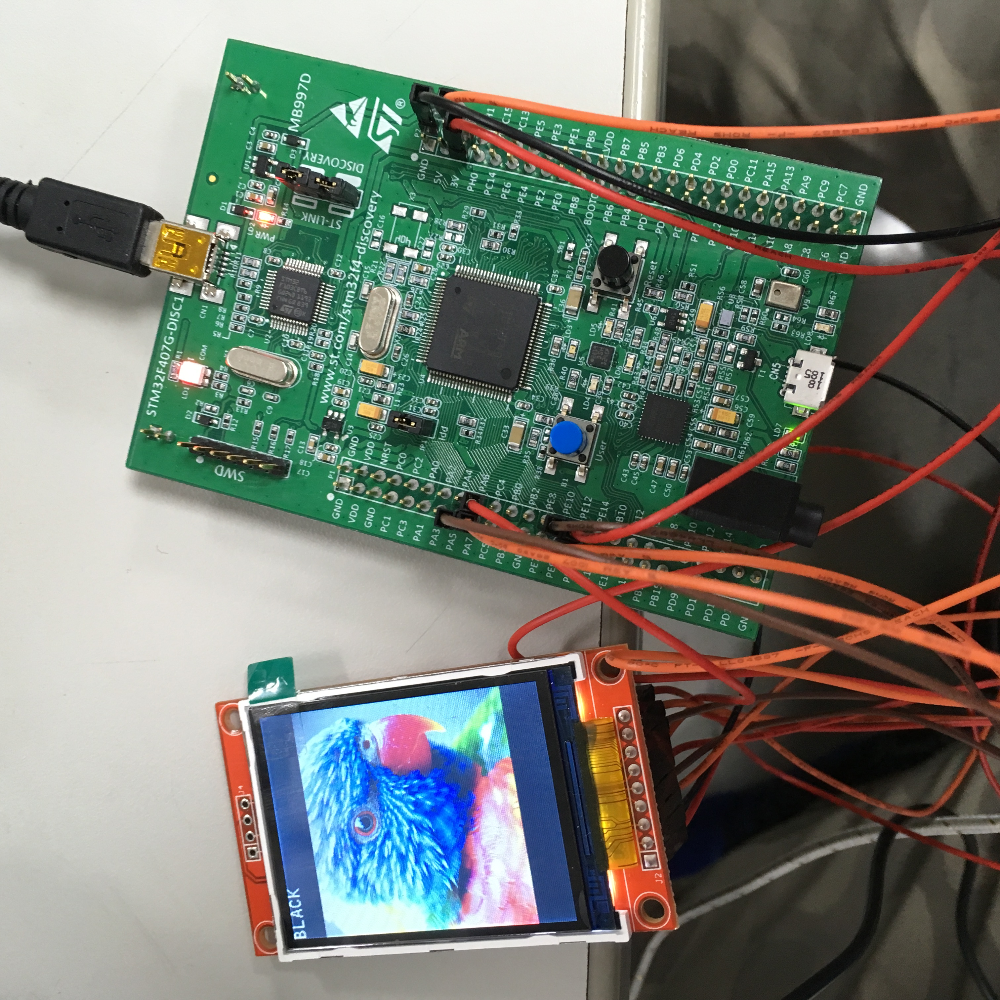

# stm32f4_disco_ili9341  
stm32f407 + ili9341 LCD  
ide : SW4STM32  
Board : STM32F4DISCOVERY  
ILI9341 pin assignments:  
   * vcc : 3V
   * led : 3V
   * rst : pe10
   * cs  : pe11
   * dc  : pe12
   * mosi: pa7
   * miso: pa6
   * sck : pa5

